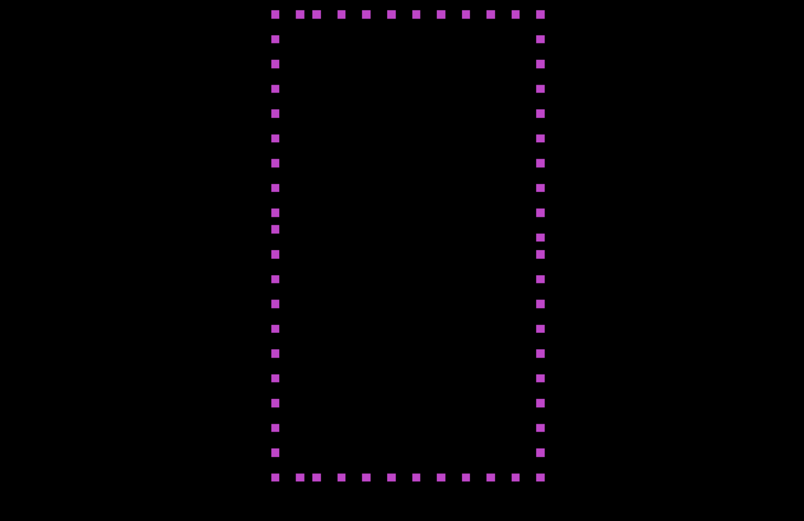
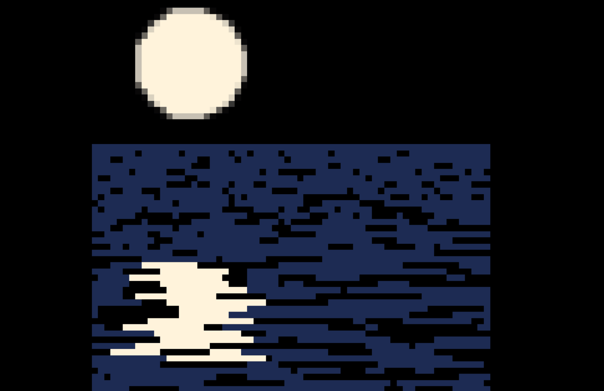

# Low Resolution Graphics

(Gameplay is much less laggy. gif creation software **significantly* slows gamplay down)

## About

In this app, I created graphics using only a 64x64 grid for low resolution. One is moonlight bouncing off water while the other is a rotating object comprised of smaller objects.

## DragonRuby

To create this game, I utilized the game engine DragonRuby. DragonRuby is an incredibly powerful game development engine that provides simplicity without taking away functionality. For more information, pleaes visit the following link:

https://dragonruby.itch.io/dragonruby-gtk
